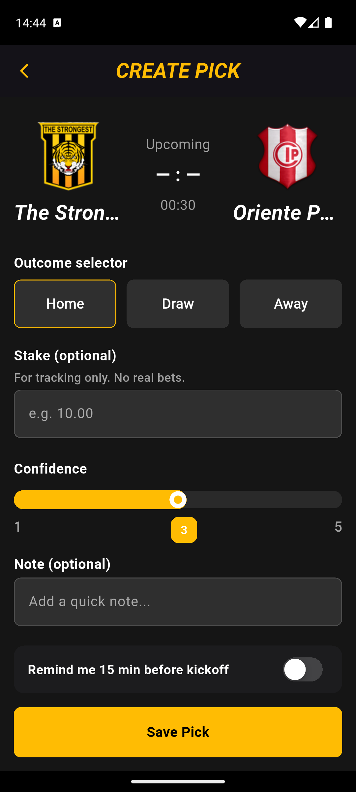
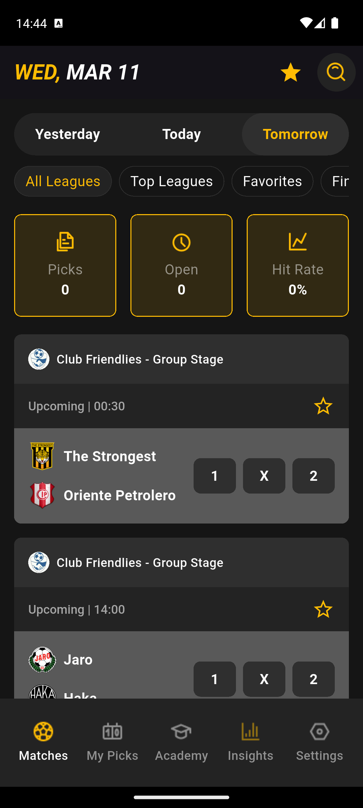
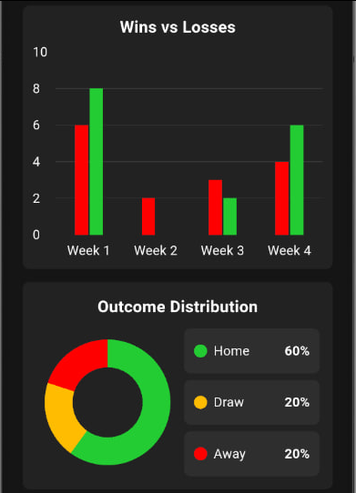

## Fortuna Stats & Academy

A high-performance Flutter application integrated with a Gambling Affiliate Program, offering a comprehensive ecosystem for match analytics, betting management, and user education.
---

## 🚀 Status
- **Google Play Store:** ✅ Verified & Published
- **Current Version:** 1.0.0
- **Build:** Flutter Stable Channel

## 📖 Overview
This application serves as a bridge between sports data and betting strategy. It provides real-time match statistics and results while offering a secure environment for users to manage their betting activities and improve their skills through a dedicated Betting Academy.

## ✨ Key Features
  * **Live Scores & Analytics: Real-time access to all matches, results, and detailed team/player statistics.
  * **Betting Management: Users can place simulated or affiliate-linked bets, track their history, and monitor their balance.
  * **Betting Academy: A structured educational module teaching users responsible and data-driven betting strategies.
  * **Personalized Insights: Advanced user statistics to analyze betting patterns and success rates.

## 📸 Screenshots

  
  
  
  

